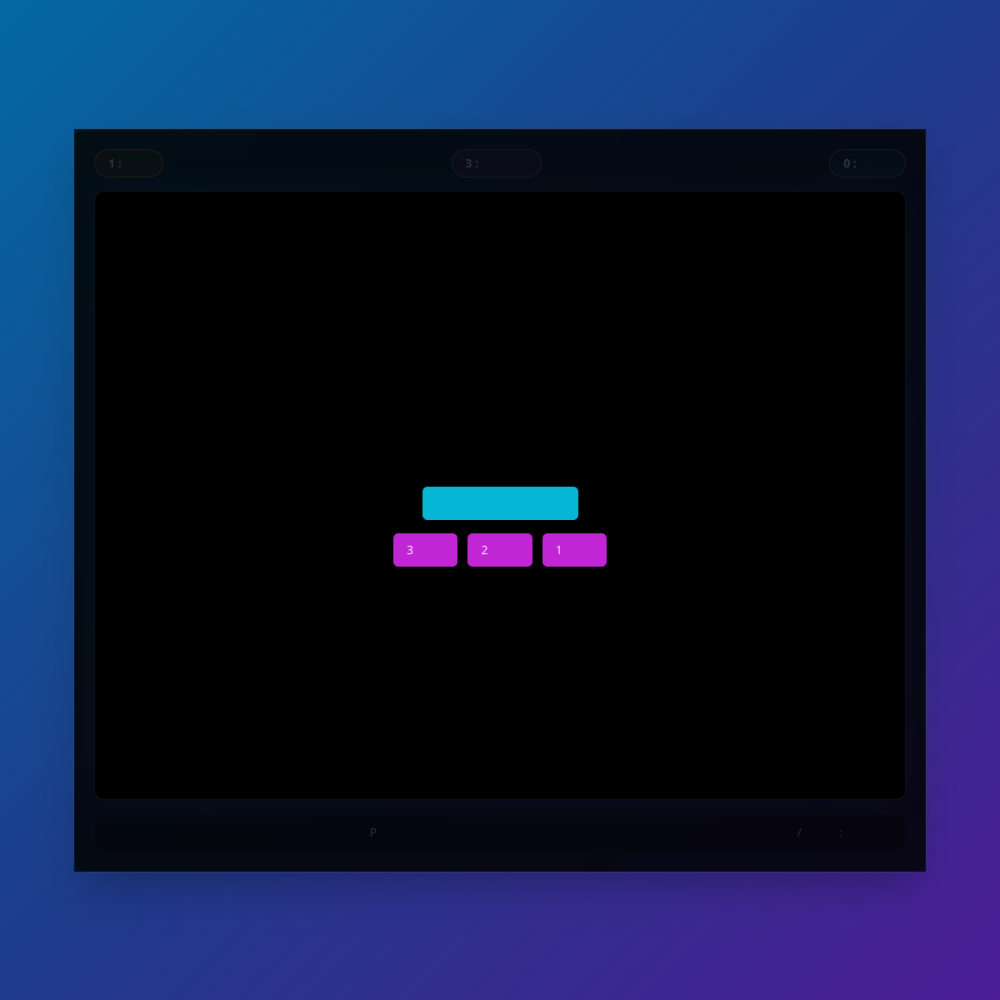
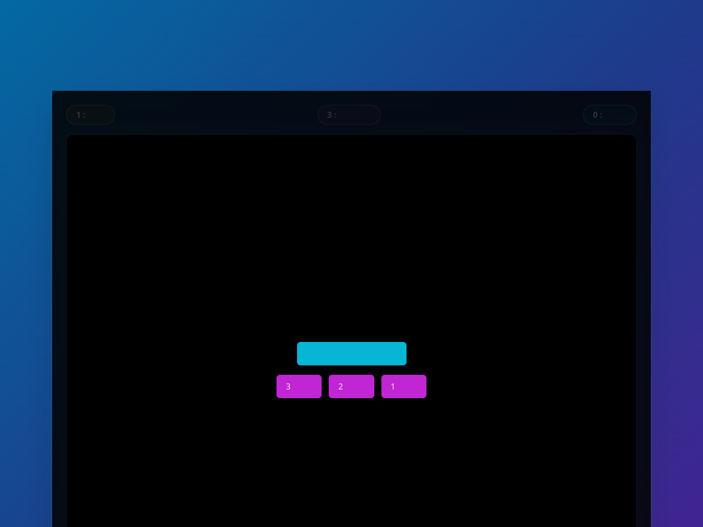

# Brick Blitz (Vibe Coding)

Brick Blitz is a browser-based brick breaker game built with Next.js and React.
The game UI is in Urdu and includes keyboard, mouse, and touch controls.


## Play Online

🎮 **Live Game URL:** [https://studio--brick-blitz-g7dx2.us-central1.hosted.app/](https://studio--brick-blitz-g7dx2.us-central1.hosted.app/)

## Game Preview

> Screenshots captured from the live hosted URL.




## Features

- 🌐 Urdu UI and overlays
- 🧱 Multiple levels
- 🧮 Lives, score, and level tracking
- ⌨️ Keyboard controls (left/right, space, P)
- 🖱️ Mouse movement support for paddle control
- 📱 Touch/click launch support
- 🔊 Arcade sound effects for:
  - Game start
  - Wall hit
  - Paddle hit
  - Brick break
  - Ball miss (life lost)
  - Game over

## Tech Stack

- Next.js
- React
- TypeScript
- Tailwind CSS

## Run Locally

```bash
npm install
npm run dev
```

Open: `http://localhost:9002`

## Build and Checks

```bash
npm run typecheck
npm run lint
npm run build
```

## Controls

- `←` / `→`: Move paddle
- `Mouse move`: Move paddle
- `Space` or `Click/Tap`: Launch ball
- `P`: Pause / Resume

## Sound Effects

Sound files are stored in `public/sounds`.
License/source details are documented in `public/sounds/LICENSE.txt`.

## Deployment

✅ Currently hosted via Firebase App Hosting at the live URL above.

This app can also be deployed on platforms like Vercel or Netlify.
